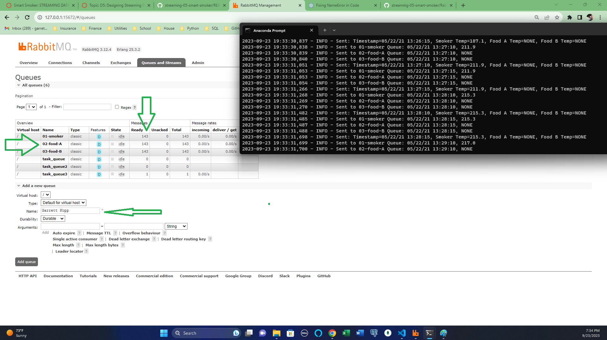

# Streaming-05-Barbecue_Smoker

## Author: Garrett Kopp

## GitHub: https://github.com/ggkopp/streaming-05-smart-smoker

## The code in this module emits messages to a consumer/listener/worker and follows the premise below, and the constraints below, notifiying the recipient when the smoker and food conditions are not optimal. 

## Streaming Data
Our thermometer records three temperatures every thirty seconds (two readings every minute). The three temperatures are:

the temperature of the smoker itself.
the temperature of the first of two foods, Food A.
the temperature for the second of two foods, Food B.
 

## Significant Events
We want know if:

The smoker temperature decreases by more than 15 degrees F in 2.5 minutes (smoker alert!)
Any food temperature changes less than 1 degree F in 10 minutes (food stall!)

## Food A and Food B Alerts: food temperature changes less than 1 degree F in 10 minutes

## Smoker Alert: The smoker temperature decreases by more than 15 degrees F in 2.5 minutes

## RabbitMQ UI's Response:

## Resources and Libraries Used: 

Chat GPT

import pika
import sys
import csv
import time
import logging
import pika
import sys
import time
import logging
from collections import deque
import datetime
